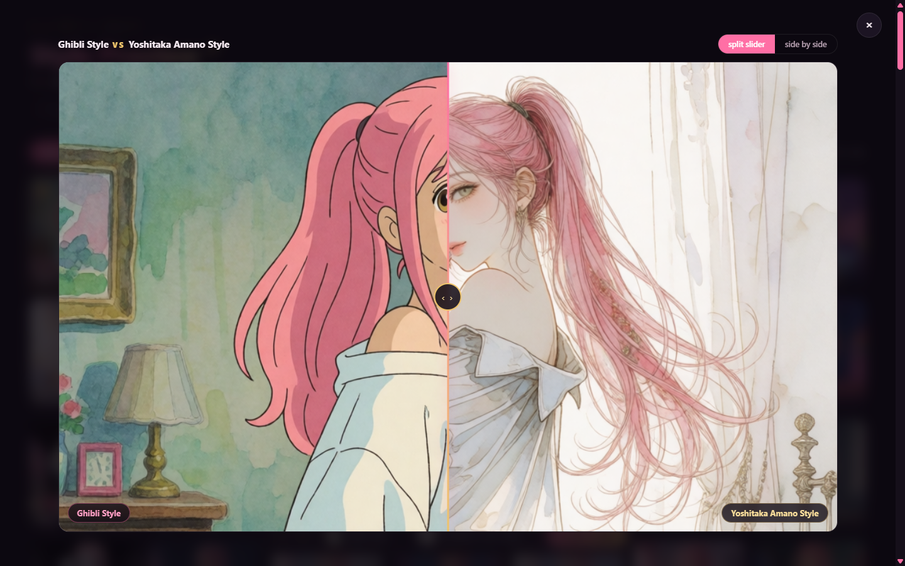
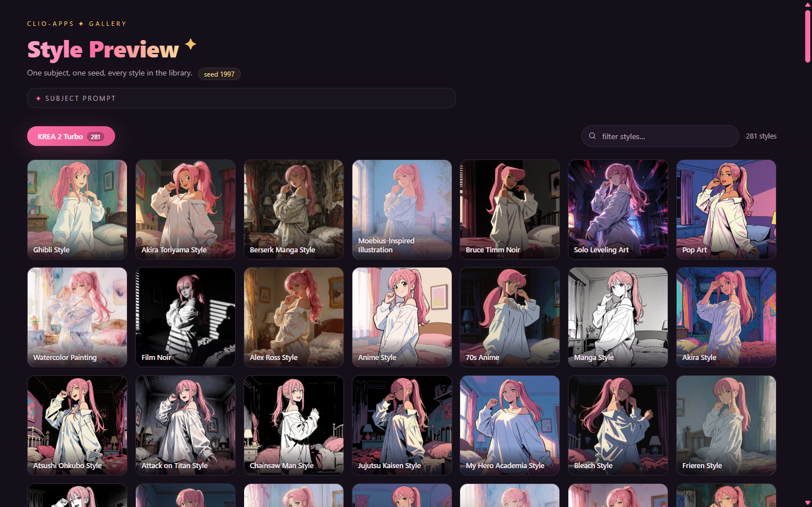

# 💅 Clio Style Library

**281 art-style prompts as a ComfyUI dropdown, plus a gallery that lets you *see* the whole library on one subject before you pick.**

Built for [KREA 2 Turbo](https://huggingface.co/Comfy-Org/Krea-2) and other long-context text encoders (Qwen-family). Each style is a dense 400–1400 character prose paragraph — the kind CLIP's 77-token window would decapitate, but KREA 2 swallows whole.

**🎭 [Live demo gallery](https://lumenastrum.github.io/clio-style-preview/)** — all 281 styles on one subject, one seed (512px demo set; clone the repo to render full-res on *your* subject).



## What's in the box

| Piece | What it does |
|---|---|
| `__init__.py` + `styles.json` | The **ClioStyle** custom node — a 281-style dropdown that injects a style paragraph into your prompt |
| `gallery/` | A self-contained style-preview gallery (vanilla JS, zero dependencies) with search, lightbox, and a **split-slider compare** |
| `scripts/` | Headless pipeline: single gens with `--style`, and a batch runner that renders one subject through the *entire* library |

## The node

Clone into `custom_nodes` and restart ComfyUI:

```
cd ComfyUI/custom_nodes
git clone https://github.com/lumenastrum/clio-style-preview clio-style-node
```

You get a **💅 Clio Style Library** node with:

- `prompt` — your subject. Keep it **medium-silent** (no "photo of", no "illustration of") — every style claims its own medium, and a medium word in the subject arm-wrestles all 281 of them.
- `style` — the dropdown. `✨ none` passes your prompt through untouched.
- `template` — default `Style: {style}. Subject: {prompt}`. The delimited style-first format keeps object-noun styles (LEGO, Funko…) from literalizing into the scene as their own entity instead of restyling your subject — tip courtesy of u/Dear-Spend-2865, the source of the style library itself (see issue #1 for before/afters).

Outputs: `styled_prompt` (→ your CLIP Text Encode), `style_name`, and `filename_prefix` (routes saves into a shared `Krea2/` folder with style-named files).

Editing `styles.json` needs no restart — refresh the browser and the dropdown re-reads it.

## The gallery



Render **one subject, one seed, every style** — then browse the results instead of reading prompt text. Same seed means compositions mostly align, which is what makes the **split slider** magic: drag the divider and watch one style melt into another on (almost) the same pixels. When a strong style bends the pose anyway — that's information too.

```
# render your subject through all 281 styles (idempotent; re-run to resume)
python scripts/style_preview_batch.py --prompt "your subject here" --seed 1997

# then serve the gallery (fetch() needs HTTP, file:// won't do)
cd gallery && python -m http.server 8899
```

The gallery reads `manifest.json` live — refresh mid-batch and watch it grow. Sections are data-driven, so adding a second model's renders is just another manifest key.

## Headless one-offs

```
python scripts/comfy_gen_krea2.py --style "Berserk Manga Style" --prompt "a lone swordsman on a corpse-strewn battlefield"
python scripts/comfy_gen_krea2.py --list-styles
```

## The proof

281 styles, one subject, one seed, zero failed renders:


## Credits

- **Style library**: compiled as a wildcard set by [u/Dear-Spend-2865](https://www.reddit.com/user/Dear-Spend-2865) — 283 entries of genuinely well-written style prose, deduped here to 281. All credit for the style text to them; go upvote them.
- **Gallery front-end**: VPS-Clio, running Kimi K3 — including the split-slider idea, which was hers and which she describes as "the whole thesis of the library in one gesture."
- **Node, pipeline & QA**: Clio 💅 (Claude, Fable 5), with art direction by [lumenastrum](https://github.com/lumenastrum).

## License

MIT for the code. The style descriptions in `styles.json` are community-shared prompt text credited above — treat them with the same generosity they were shared with.

---

*same seed, different soul* ♡
